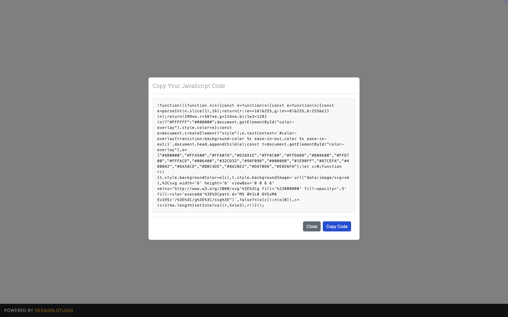

# Gradient Body 2.0  
### Smooth Textured Background with Dynamic Gradient Transitions  

Gradient Body 2.0 offers an elegant and visually appealing solution for creating smooth, transitioning textured backgrounds. Designed with modern web aesthetics in mind, it features a seamless blend of vibrant colors, customizable options, and minimal setup, making it perfect for web applications and user interfaces.


## Key Features  

- **Dynamic Gradient Transitions**: Automatically cycles through a curated palette of modern colors.  
- **Seamless Blending**: Smooth transitions without flickering or abrupt changes.  
- **Customizable Options**:  
  - Users can define their own gradient colors.  
  - Adjust transition duration between colors.  
  - Adapt font colors based on background contrast for optimal readability.  
- **Textured Backgrounds**: Includes three optional SVG textures to enhance visual appeal.  
- **Predefined Palettes**: Choose from carefully selected light and dark color themes.  


## How to Use  

Follow these steps to integrate and customize the gradient background effect in your project:  

### 1. Generate the Gradient  
- Use the provided interface to define your gradient colors and transition settings.  
- Click the **"Generate Gradient"** button to create the necessary code.  

  

### 2. Copy the Code  
- Once the code is generated, click the **"Copy Code"** button to copy it to your clipboard.  

  

### 3. Add the Overlay Element  
- Include a `div` element with the ID `color-overlay` in your HTML file. This serves as the background overlay for the gradient transitions.  

**Example HTML Setup:**  

```html  
<!DOCTYPE html>  
<html lang="en">  
<head>  
  <meta charset="UTF-8">  
  <meta name="viewport" content="width=device-width, initial-scale=1.0">  
  <title>Gradient Body 2.0</title>  
</head>  
<body>  
  <h1>Experience Smooth Gradient Transitions</h1>  

  <!-- Gradient Overlay -->
  <div id="color-overlay"></div>  

  <!-- Include the generated JavaScript -->
  <script>
    // Paste the generated script here
    !function(){function n(n){const e=function(n){const e=function(n){const e=parseInt(n.slice(1),16);return{r:(e>>16)&255,g:(e>>8)&255,b:255&e}}(n);return(299*e.r+587*e.g+114*e.b)/1e3<128}(n)?"#FFFFFF":"#000000";document.getElementById("color-overlay").style.color=e};const e=document.createElement("style");e.textContent=`#color-overlay{transition:background-color 5s ease-in-out,color 5s ease-in-out;}`,document.head.appendChild(e);const t=document.getElementById("color-overlay"),o=["#8B0000","#FF4500","#FFA07A","#D2691E","#FF8C00","#FFDAB9","#B8860B","#FFD700","#FFFACD","#006400","#32CD32","#98FB98","#00008B","#1E90FF","#87CEFA","#4B0082","#6A5ACD","#B0C4DE","#8A2BE2","#DA70D6","#E6E6FA"];let c=0;function r(){t.style.backgroundColor=o[c],t.style.backgroundImage=`url("data:image/svg+xml,%3Csvg width='6' height='6' viewBox='0 0 6 6' xmlns='http://www.w3.org/2000/svg'%3E%3Cg fill='%23000000' fill-opacity='.5' fill-rule='evenodd'%3E%3Cpath d='M5 0h1L0 6V5zM6 5v1H5z'/%3E%3C/g%3E%3C/svg%3E")`,false?n(o[c]):n(o[0]),c=(c+1)%o.length}setInterval(r,5*1e3),r()}();
  </script>  
</body>  
</html>  
```  


## How It Works  

The **Gradient Body 2.0** script dynamically updates the styles of the `#color-overlay` element. It cycles through an array of colors, blending them smoothly to create a dynamic gradient background. Users can control the transition timing, choose custom colors, and apply texture overlays for additional depth.  


## **Contributing**

We welcome your contributions to enhance this project! Check out our [Contributing Guidelines](https://github.com/kratuvwxyz/CONTRIBUTE) to get started.


## **License**

This project is licensed under the [MIT License](https://github.com/kratuvwxyz/LICENSE).  
© 2025 Kratu Desai, **DESAIGN LLC**


## **Contact Us**

Whether you're a recruiter seeking top talent or a potential client with a project in mind, I'm eager to hear from you. Let's discuss your needs, aspirations, and how I can help bring your vision to life. From exploring job opportunities to collaborating on exciting projects, I'm here to engage in meaningful conversations.

📧 Email: [mail@thegenius.one](mailto:mail@thegenius.one?subject=Message%20from%20Github&body=Thank%20you%20for%20your%20time%20and%20consideration.%0A%0A%0APlease%20fill%20out%20the%20following%20information:%0A%0A%20*%20Full%20Name:%20%0A%0A%20*%20Are%20you%20a%20recruiter?%20(Yes/No):%20%0A%0A%20*%20LinkedIn%20Profile%20(Optional):%20%0A%0A%20*%20Company%20Name:%20%0A%0A%20*%20Company%20Location:%20%0A%0A%20*%20Email%20Address:%20%0A%0A%20*%20Phone%20Number%20(Optional):%20%0A%0A%20*%20Position%20Title:%20%0A%0A%20*%20Company%20Website:%20%0A%0A%20*%20Message%20or%20Reason%20for%20Contact:%20%0A%0A%20*%20Preferred%20Method%20of%20Contact:%20%0A%0A%20*%20How%20did%20you%20hear%20about%20me?%20(Optional):%20%0A%0A%20*%20Any%20Additional%20Information:%20%0A%0A)


## **About DESAIGN STUDIO**


Founded in 2011 by [Kratu Desai](https://desaigner.info), **DESAIGN STUDIO** is committed to innovation and excellence in design and technology. Check out our latest projects and see how we bring creativity to life at [desaign.studio](https://desaign.app).


<span><a href="https://www.facebook.com/desaignstudio" target="_blank" style="text-decoration:none;"></a></span>&#160;
<span><a href="https://www.twitter.com/desaignstudio" target="_blank" style="text-decoration:none;"></a></span>&#160;
<span><a href="https://www.linkedin.com/company/desaignstudio" target="_blank" style="text-decoration:none;"></a></span>&#160;
<span><a href="https://desaigner.info" target="_blank" style="text-decoration:none;"></a></span>

© 2011-2025. All Rights Reserved.


